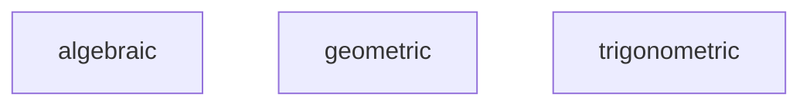
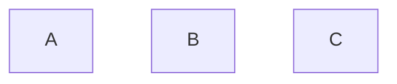
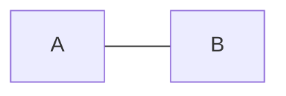
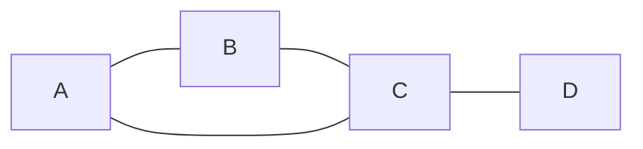
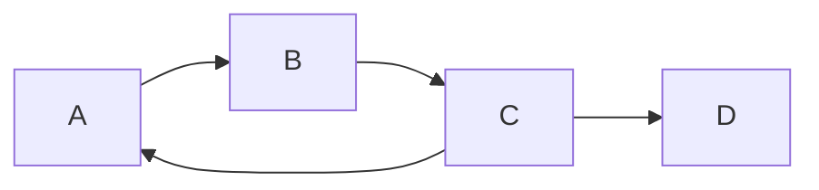
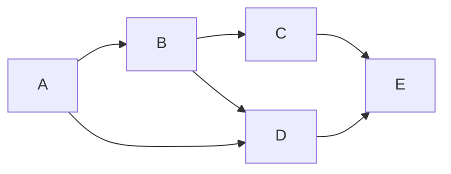
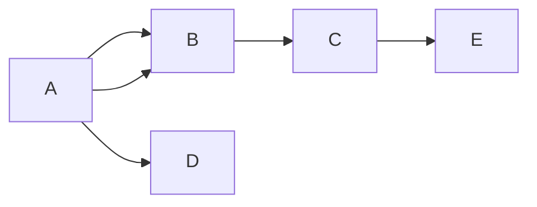
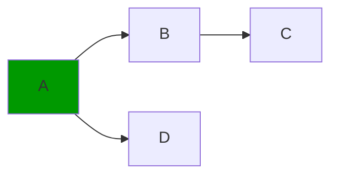
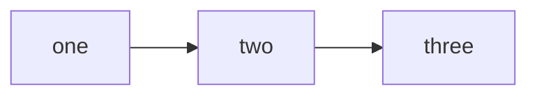
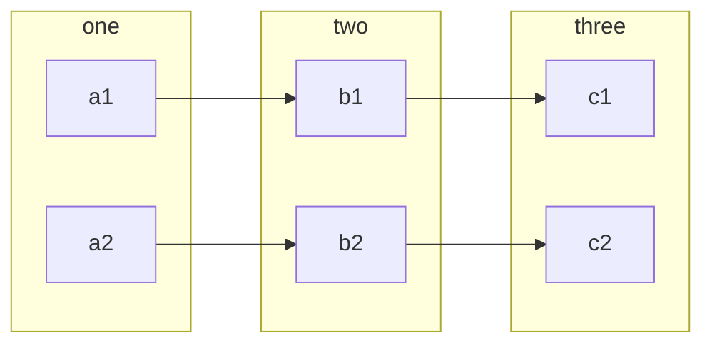

# Tools
- mathematica
- vscode
- math
- programming
- github

# Partitioning
- lines
- points
- surface of a sphere
- curve
- graph
- geometric
- algebraic
- probability

# Order
- non ordered
- total order
- partial order
- preorder

# DAG

### A directed acyclic graph (DAG) is a graph that has no cycles and is directed. This means that the edges have a direction and that there is no way to start at a vertex and follow the edges back to the same vertex. This is useful in many applications, such as scheduling, task management, and data processing.

# Void(canvas)

# Nodes ( no order )

# Edges

# Non Directed Graph

# Directed Graph

# Directed Acyclic(no cycles) Graph
> With a join

# Tree
> No Joins

# Multi Directed Acyclic Graph

# BiCartesian Category

# Petri Net

