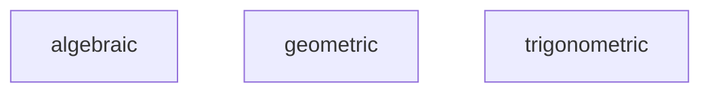
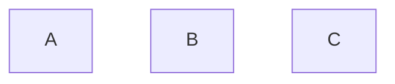
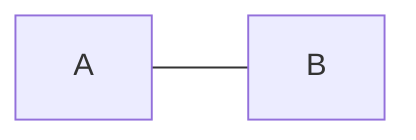
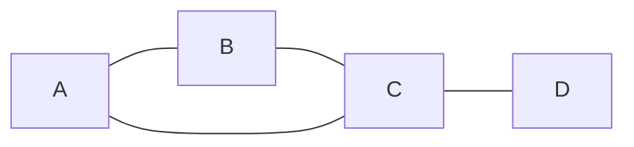
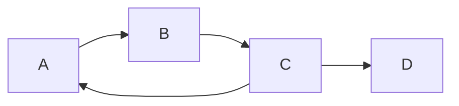
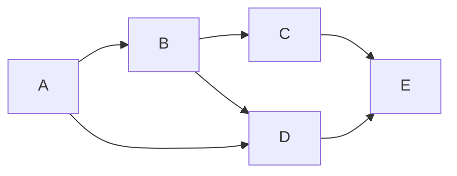
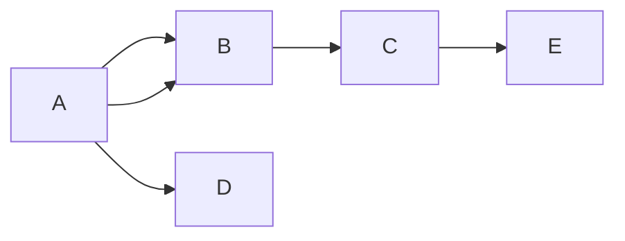
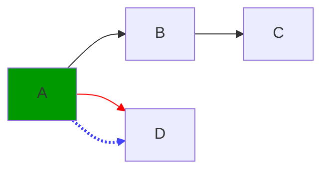
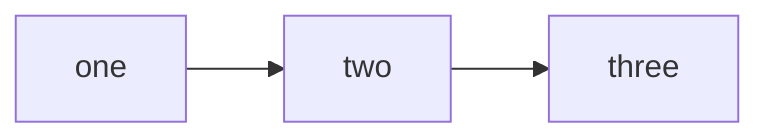
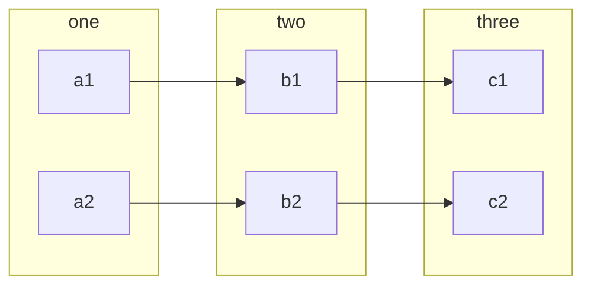

# Narrative 

Mathematics is useful independent of any particual field or application.

We are not going to do any calculations or proofs. Instead we will focus on looking at ones own internal perception of nature and the world around us.

What kinds of patterns come up in our thoughts and how do we use them to make decisions?

These tools can help reduce confusion by removing unecessary complexity. 

# 40 symbols
- verbal
- written
- sign language
- touch like braille

# Concrete Examples

For example if we are trying to understand a complex system we can use these tools to break it down into smaller parts and then recombine them in a way that is more managable.

In your own mind can you see how no matter the subject of your attention it seems to act like a kind of knife. And by that I mean it splits or cuts into at least two parts. 

For example with something as familiar as food. 

# imediate usefullness
- scale and proportion
    - ratios
    - percentages
    - zooming in and out
- estimation
    - rounding
    - approximating
    - guessing
- counting
    - measuring
    - comparing
- graphs and systems
    - patterns
    - relationships
- compose & combine 
    - multiplication
    - addition
    - division
    - subtraction

# Tools
- mathematica
- vscode
- github

# Partitioning Space
- lines
- points
- surface of a sphere
- curve
- graph
- geometric
- algebraic
- probability

# Order
- non ordered
- total order
- partial order
- preorder

# Prepositions

# Mereology

# Simple to Complex
- many small simple things can be combine to make a complex thing
- a complex thing can be broken down into many small simple things

# DAG

### A directed acyclic graph (DAG) is a graph that has no cycles and is directed. This means that the edges have a direction and that there is no way to start at a vertex and follow the edges back to the same vertex. This is useful in many applications, such as scheduling, task management, and data processing.

# Void(canvas)

# Nodes ( no order )

# Edges

# Non Directed Graph

# Directed Graph

# Directed Acyclic(no cycles) Graph
> With a join

# Tree
> No Joins

# Multi Directed Acyclic Graph

# BiCartesian Category

# Petri Net

